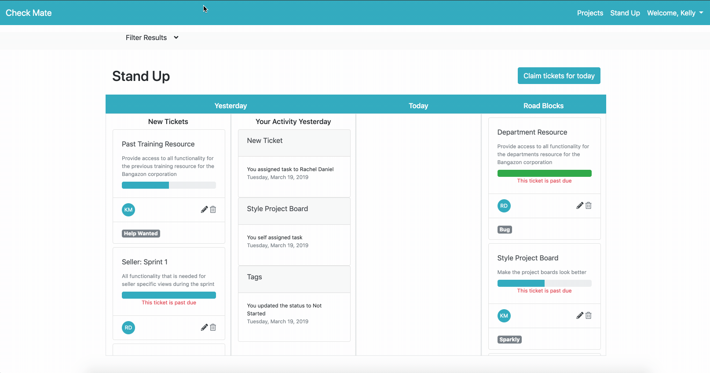
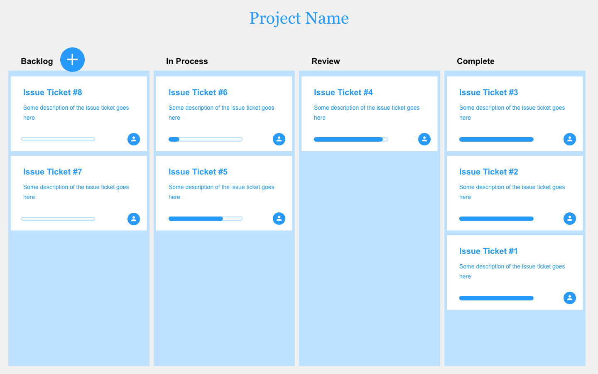

# Welcome to Check Mate

Check Mate was developed out of necessity to streamline the project management process for software developers. The current tools available to manage the process of integrating new features into a project are cumbersome and not easy to work with. Most importantly, these options do not provide software developers with the most essential information to them so that they can easily communicate their priorities for the day during stand up meetings. By creating a more intuitive user flow, developers will be able to spend less time managing their projects and more time doing what they do best, solving problems.

## Table of Contents
* [Project Requirements and Features List](#project-requirements-and-features-list)
* [Technologies Used](#technologies-used)
* [Installing and Launching Check Mate](#instructions-for-installing-check-mate)
* [Appendix: Planning Documentation](#appendix-planning-documentation)
  * [Entity Relationship Diagrams](#entity-relationship-diagram)
  * [Wireframes](#wireframes)

## Project Requirements and Features List
### Project Views
From the project view the user can create new projects, edit existing projects, filter project results based on status or select a project to view more details. The project detail view allows users to see all tickets broken out by status, filter by tags or assigned user and select to see more details about the ticket and it's related tasks.

### Stand-Up View
From the stand-up view the user can view all tickets and tasks created yesterday, as well as their activity from the previous day, claimed tickets for the day and any tickets that have been marked as a road block. If the user does not have any tickets claimed for the day, they can select that option to view all tickets and tasks they can take ownership of and select the ones they'd like to claim for the day. From the edit view, the user can see the tickets they've claimed for the day, remove any as they'd like and add new claimed tickets.

## Technologies Used
  ### Development Languages and Libraries
  </img> </img>
  ### Development Tools
  </img> </img> </img> </img>

## Instructions for Installing Check Mate
  - Create an empty directory to house your new project
  - run `virtualenv env` to create a virtual environment within that directory
  - run `source env/bin/activate` to initialize a virtual environment (`deactivate` to exit environment)
  - run `git clone [repository id]`
  - run `cd project`
  - run `pip install -r requirements.txt`

### Seed a Starter Database
  - Run `python manage.py makemigrations`
  - Run `python manage.py migrate`
  - If you want some data to play with, run `python manage.py loaddata db.json`
  - Initialize the project using the command line by typing `python manage.py runserver` in the main directory.
  - Access the application in a browser at `http://localhost:8000`.

### Congratulations! You are now experiencing Check Mate!

  ## Appendix: Planning Documentation

  ### Entity Relationship Diagram
  

  ### Wireframes/ Mockups
  </img> </img>
  </img> 
